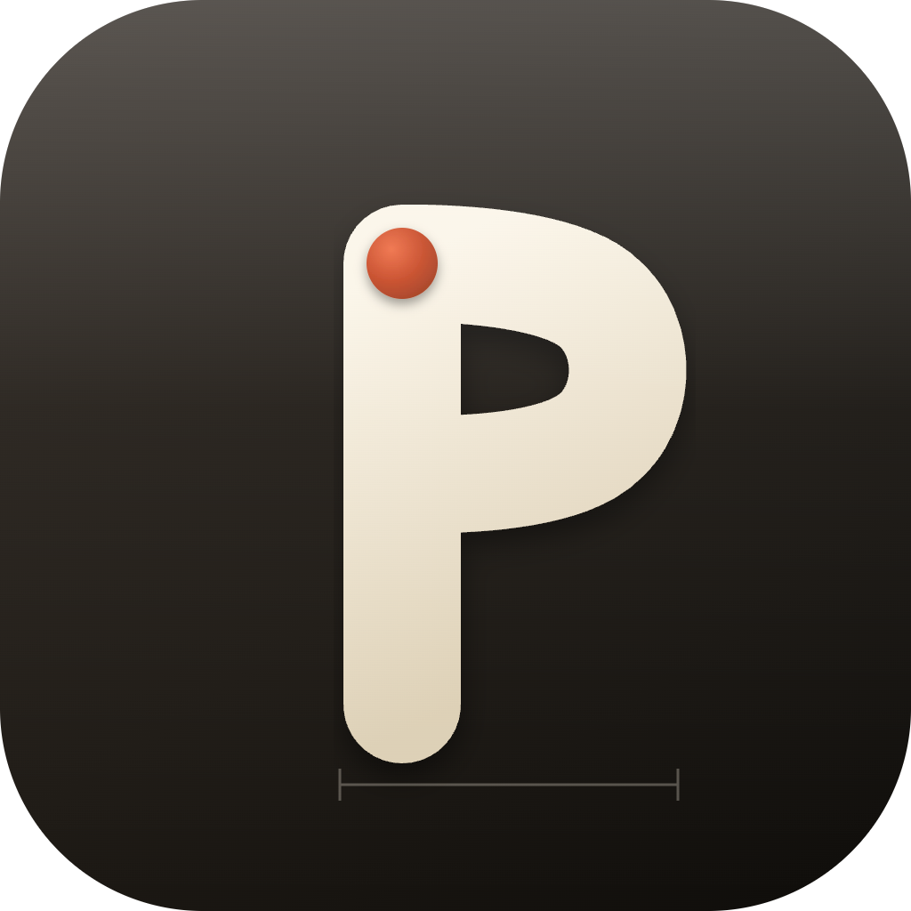

<h1 align="center">
   Praxis
</h1>

<p align="center">
  <a href="https://github.com/davidacres/praxis/stargazers"></a>
  <a href="https://github.com/davidacres/praxis/releases"></a>
  
  
</p>

<p align="center">

<h1>This is a preview, if you would like to contribute or have any ideas, suggestions then please contact me in the discussion board.</h1>
  
  <strong>The workspace where boards, AI agents and delivery meet.</strong><br/>
  Plan on a board, hand a ticket to an agent, review the diff, ship it — on your desktop, and from your phone.
</p>

<h3 align="center"><a href="https://github.com/davidacres/praxis/releases/latest"><ins>Download Praxis</ins></a></h3>

<p align="center">
  
</p>

## Features

<table>
<tr>
<td width="50%" valign="middle">

### Mobile Companion

Follow live sessions from your phone, read activity, and approve or deny the agent's permission requests from anywhere on your network — end-to-end encrypted, no cloud relay.

[Docs →](docs/published-artifacts/praxis-on-your-phone.html)

</td>
<td width="50%">
  <a href="docs/published-artifacts/praxis-on-your-phone.html"></a>
</td>
</tr>
<tr>
<td width="50%" valign="middle">

### Boards for Any Backend

One board over Jira, GitLab, GitHub, a folder of markdown plans, or app storage. The workflow is data — author the stages once and every backend renders them natively.

[Docs →](docs/published-artifacts/project-details-and-board-surface.html)

</td>
<td width="50%">
  <a href="docs/published-artifacts/project-details-and-board-surface.html"></a>
</td>
</tr>
<tr>
<td width="50%" valign="middle">

### Hand a Ticket to an Agent

Turn a ticket into a session. The agent plans the work, asks before it uses a tool, and reports what it changed. Switch provider mid-session with a handover brief.

[Docs →](docs/published-artifacts/handing-a-ticket-to-an-agent.html)

</td>
<td width="50%">
  <a href="docs/published-artifacts/handing-a-ticket-to-an-agent.html"></a>
</td>
</tr>
<tr>
<td width="50%" valign="middle">

### Review Before You Commit

Every session records the files it touched. Read the diff beside the conversation, then commit or discard in one click. A native Git Graph covers staging, stashes and conflicts.

[Docs →](docs/published-artifacts/handing-a-ticket-to-an-agent.html)

</td>
<td width="50%">
  <a href="docs/published-artifacts/handing-a-ticket-to-an-agent.html"></a>
</td>
</tr>
<tr>
<td width="50%" valign="middle">

### Themes &amp; Surface Packs

Looks, surface patterns and sidebar styles — Noir, Blueprint, Graphite, Parchment, Aurora Glass and more — switchable in Settings and extensible with add-ons.

[Docs →](docs/published-artifacts/praxis-surface-packs.html)

</td>
<td width="50%">
  <a href="docs/published-artifacts/praxis-surface-packs.html"></a>
</td>
</tr>
<tr>
<td width="50%" valign="middle">

### Agent Runtime &amp; Add-ons

Built-in Planner, Implementer, Reviewer, Security Analyst and Test Author agents, plus a marketplace for agents, skills, themes and workflow templates.

[Docs →](docs/published-artifacts/praxis-interface-system.html)

</td>
<td width="50%">
  <a href="docs/published-artifacts/praxis-interface-system.html"></a>
</td>
</tr>
</table>

**Also in the box:**

- **Native Git Graph** — Working, staged, commit and ref comparisons; inline, split and hunk views; file, hunk and line staging; stashes; three-way conflict resolution.
- **Workspaces** — Save a shareable set of projects and connections in a `.workspace.praxis.json` file and commit it. Secrets never travel with it.
- **Governed delivery workflows** — Stage-based runs with policies and bounded QA self-healing.
- **Folder-backed plans** — Point a project at a folder of markdown plans; the board is synthesised from the files.
- **Auto-update** — Signed builds check for and install updates in the background.

---

## Supported Agents

Works with the CLI agents you already use — sessions run against your own sign-in.

<p>
  <a href="https://docs.anthropic.com/claude/docs/claude-code"><kbd>Claude Code</kbd></a> &nbsp;
  <a href="https://github.com/openai/codex"><kbd>Codex</kbd></a> &nbsp;
  <a href="https://github.com/google-gemini/gemini-cli"><kbd>Gemini CLI</kbd></a> &nbsp;
  <a href="https://docs.github.com/en/copilot/how-tos/set-up/install-copilot-cli"><kbd>GitHub Copilot</kbd></a> &nbsp;
  <kbd>+ any ACP agent</kbd>
</p>

---

## Install

### Desktop — macOS, Windows, Linux

- **[Download the latest release](https://github.com/davidacres/praxis/releases/latest)** — `.dmg` (macOS), `-setup.exe` (Windows), `.AppImage` / `.deb` (Linux)
- Or build from source — see [Development](#development).

### Mobile Companion — iOS, Android

Pair with your desktop app (Settings → Mobile access → *Create pairing code*) to follow sessions and approve agent requests from your phone. The app lives in [`apps/praxis-mobile`](apps/praxis-mobile/README.md).

---

## Repository layout

An npm workspaces monorepo — the app in `apps/`, shared code in `packages/`:

```
apps/
└── praxis-desktop/
    ├── main/         Electron main + preload, e2e suite, packaging
    └── renderer/     React/Vite SPA — the app's UI

packages/
└── core/             shared types, stores, backend adapters, folder/plans
                      parser, AI gateway
```

```
   ┌──────────────────────┐
   │ packages/core        │   types, stores, parsers, AI/MCP plumbing
   │ @praxis/core         │
   └──────────▲───────────┘
              │ shared by
   ┌──────────┴───────────┐
   │ praxis-desktop/      │
   │ renderer (React SPA) │
   └──────────┬───────────┘
              │ vite build + copy-renderer
              ▼
   ┌──────────────────────┐  electron-builder  ┌────────────────────┐
   │ praxis-desktop/main  │ ─────────────────► │ branded installers │
   │ (Electron host)      │                    │ .dmg / setup.exe   │
   └──────────────────────┘                    └────────────────────┘
```

`@praxis/core` is imported by `main` directly and by `renderer` for types. Run
`npm install` once at the repo root; the workspaces share a hoisted
`node_modules/`.

## Workspace / project / connection model

- **Workspace** — a saved, shareable context (`.workspace.praxis.json`) that groups
  project and connection references without copying their data. The sidebar has a
  workspace switcher; the tree is scoped to the active workspace. Exported files
  carry a `schemaVersion` and the app versions that wrote them, and contain
  references only — never connection secrets.
- **Project** — the unit of planned work, with one board. Work items live either
  in app storage or as markdown plans in the project's folder.
- **Connection** — an external/system backend: Jira MCP, Demo, a folder of
  markdown plans, or a GitLab delivery host.

Desktop Settings → Startup includes **Reopen last workspace**, which restores the
last valid workspace and durable view. With no valid open workspace, Praxis shows
a full-window Getting Started experience for creating or opening one. Projects are
always created inside the open workspace; the first project becomes its default.

## Git workspace

Praxis includes a native Git Graph and diff workspace backed by the installed Git
executable. The Electron main process owns repository discovery and Git commands;
the sandboxed renderer receives typed commit, file, hunk, line, history, blame,
and conflict records through preload IPC. It supports working/staged/commit/ref
comparisons, Inline/Split/Hunk views, file/hunk/selected-line staging, confirmed
discard, branch and commit actions, stash workflows, and three-way conflict
resolution.

## Backend modes

| Mode | Value | Support |
| --- | --- | --- |
| Jira MCP | `jiracloud` | Primary hosted tracker. Backed by an external Jira MCP server. Board/issue operations, comments, transitions, linked-epic flows, delivery automation. |
| Demo | `demo` | Built-in sample data for development and demos. Off by default. |
| Folder | `folder` | Reads markdown feature plans from one or more folders on disk; can optionally create/update local issue files. |
| GitLab | `gitlab` | Connection and delivery/MR workflows; the issue/board model does not match Jira parity. |
| GitHub | `github` | Configuration surface only; no full board/issue backend yet. |

## Development

```bash
npm install
npm run build            # core -> renderer -> copy-renderer -> desktop
npm run build:core       # just the shared core (must precede the rest)
npm run build:renderer

npm run check-types      # every workspace

npm test                 # core + desktop
npm run test:core        # node:test
npm run test:desktop     # Playwright e2e (loads the pre-built renderer)
npm run test:desktop:git # gitService unit tests
```

The e2e suite loads the pre-built renderer from
`apps/praxis-desktop/main/renderer/`. A renderer change is invisible to e2e until
you rebuild **and** run `npm run desktop:copy-renderer`.

The "hand a ticket to an agent" flow has its own coverage. `aiCodingTask.spec.ts`
drives it end to end with a scripted ACP agent fixture — no model, part of the
normal suite. `aiLiveAgent.live.spec.ts` drives a real CLI agent against a real
model; it spends money, is excluded from every ordinary run, and needs an explicit
opt-in:

```bash
cd apps/praxis-desktop/main
PRAXIS_LIVE_AGENT=1 npx playwright test --project=live-agent
```

Cross-provider handover (two signed-in CLIs, spends twice) is the same project:

```bash
cd apps/praxis-desktop/main
PRAXIS_LIVE_AGENT=1 npx playwright test --project=live-agent e2e/aiLiveHandover.live.spec.ts
```

### Run the app

```bash
npm run app:demo:mac         # macOS, with demo fixture data
./scripts/run-app.sh --demo  # equivalent shell flag
```

Normal launches start without sample data.

### Build installers

```bash
# macOS
npm run app:build:mac        # compile app + prepare renderer (no electron-builder)
npm run app:installer:mac    # electron-builder -> apps/praxis-desktop/main/dist/ (*.dmg)

# Linux
npm run app:build:linux      # compile app + prepare renderer (no electron-builder)
npm run app:installer:linux  # electron-builder -> apps/praxis-desktop/main/dist/ (*.AppImage, *.deb)
# Or use the script directly:
./scripts/build-installer.sh --target linux      # AppImage + deb
./scripts/build-installer.sh --target appimage   # AppImage only
./scripts/build-installer.sh --target deb        # deb only

# Windows (PowerShell)
npm run app:build:win
npm run app:installer:win    # electron-builder -> apps/praxis-desktop/main/dist/ (*-setup.exe)
```

The macOS DMG, Linux packages, and Windows assisted installer share the app's warm charcoal, parchment, and terracotta visual language.

### Signing and updates

A packaged build updates itself from the GitHub Releases of the repo named in
the `publish` config (`src/main/autoUpdate.ts`). It checks 30 seconds after
launch and every 4 hours, downloads a newer release in the background, and
installs it on the next quit — or straight away from the title bar's **Restart
to update** button. **Settings → Workspace → Updates** shows the state and has a
manual check. Releases must be public (the updater reads them anonymously), must
not be drafts, and need the `latest*.yml` and `.blockmap` files that
`scripts/publish-desktop-release.sh` uploads.

In development `update:check` reports `unsupported` with the reason rather than
failing quietly; `PRAXIS_DISABLE_UPDATES=1` does the same in a packaged build.
macOS only installs updates into a Developer ID signed build (Squirrel.Mac
refuses anything else); an unsigned Mac build still finds updates and links to
the release page instead.

Publishing is driven entirely by environment variables, so an unsigned local
build behaves exactly as it always did — electron-builder skips signing and
notarization when the credentials are absent:

| Variable | For |
| --- | --- |
| `GH_TOKEN` | uploading the release |
| `CSC_LINK` / `CSC_KEY_PASSWORD` | the Developer ID certificate (macOS) or code-signing cert (Windows) |
| `APPLE_ID` / `APPLE_APP_SPECIFIC_PASSWORD` / `APPLE_TEAM_ID` | notarization |

```bash
npm run dist:mac:publish --workspace=@praxis/desktop-main
npm run dist:win:publish --workspace=@praxis/desktop-main
```

The update feed is explicitly pinned to `davidacres/praxis` in the desktop
package's electron-builder configuration. Release builds include the updater
manifests and blockmaps; macOS builds also include the ZIP consumed by
Squirrel.Mac alongside the user-facing DMG.

**macOS updates require a signed build.** Squirrel.Mac refuses unsigned
bundles, so an unsigned build can find an update but not install one — it
reports `available` with `canInstall: false` rather than pretending to apply
it. `build/entitlements.mac.plist` carries the hardened-runtime entitlements
Electron, node-pty, and the CLI agent subprocesses need.

## Known limitations

- GitHub mode is not yet a full issue/board backend.
- GitLab support is strongest around delivery/MR workflows.
- Task Designer website-preview nodes only show sites that permit iframe embedding.
- Some automation flows depend on correct Jira/GitLab credentials, workflow
  settings, tracked boards, and repository setup.
