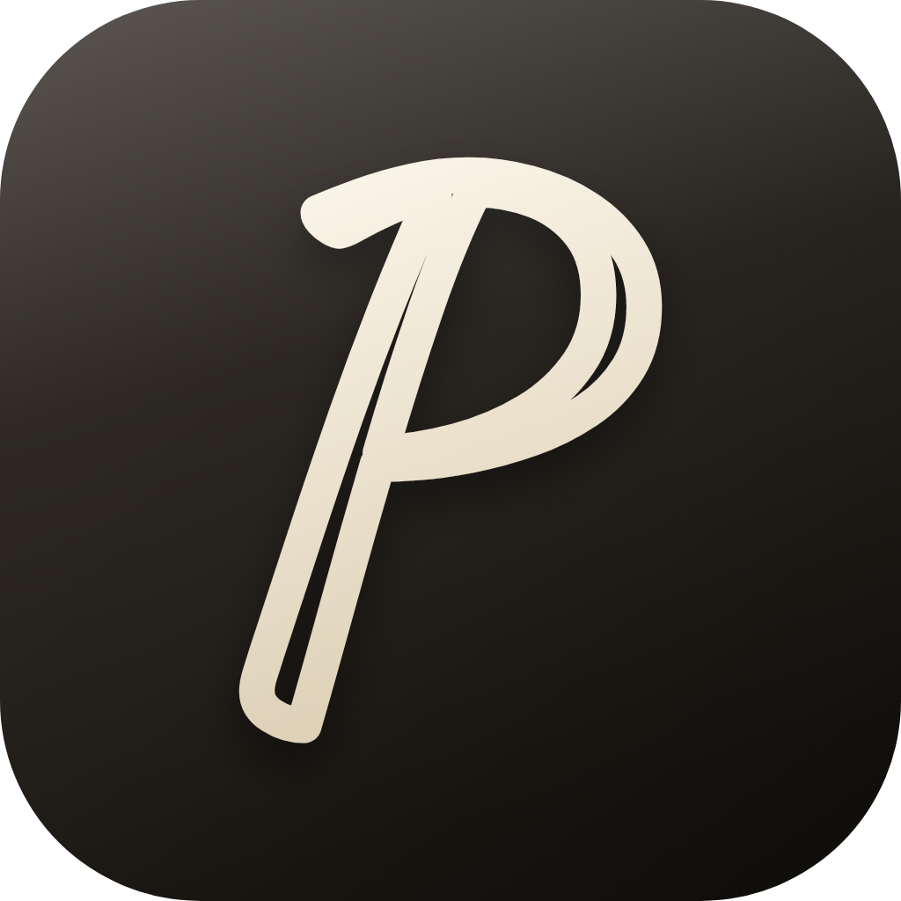
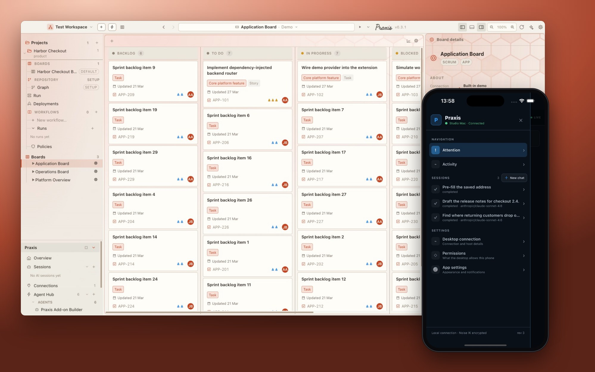
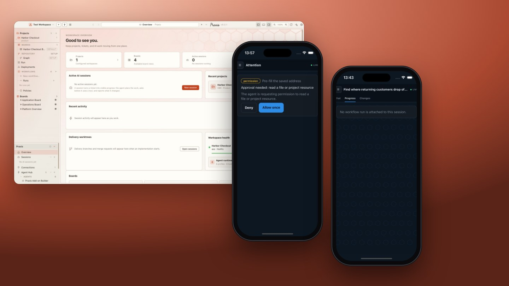
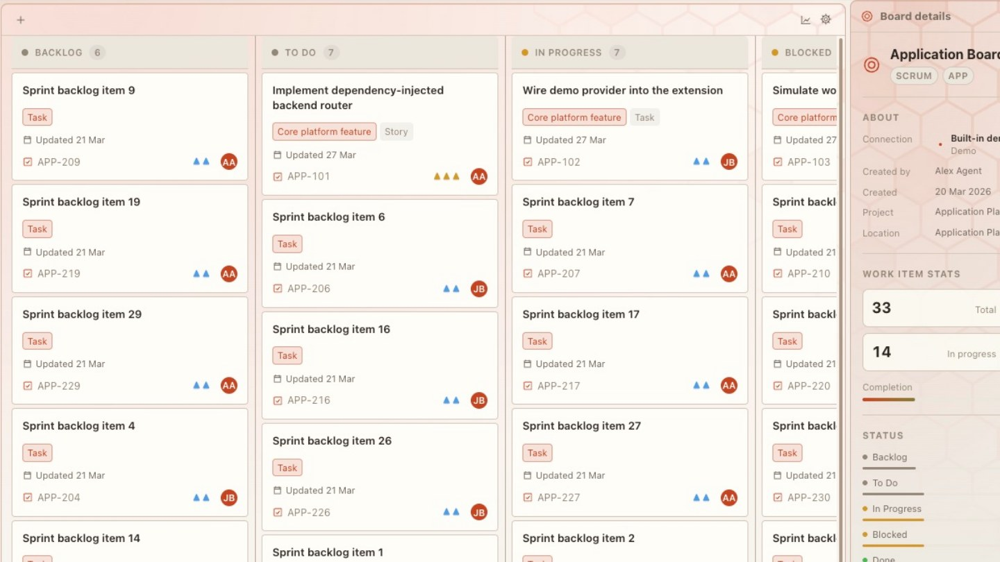
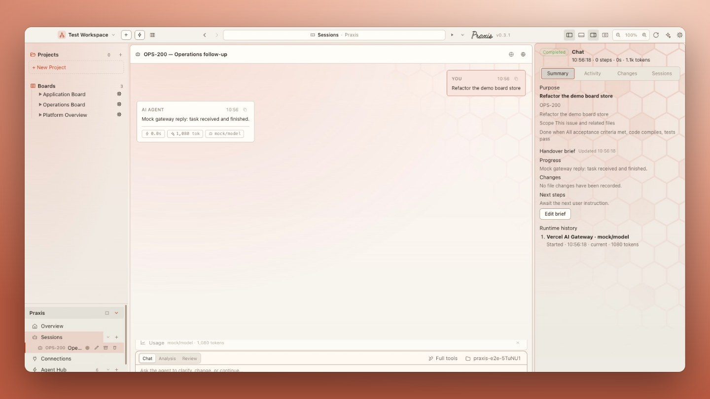
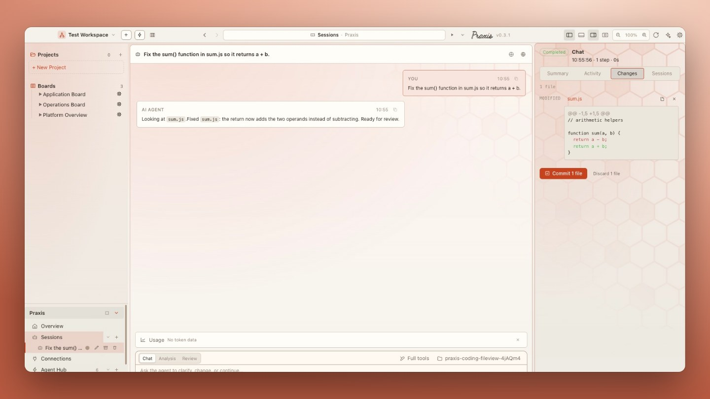
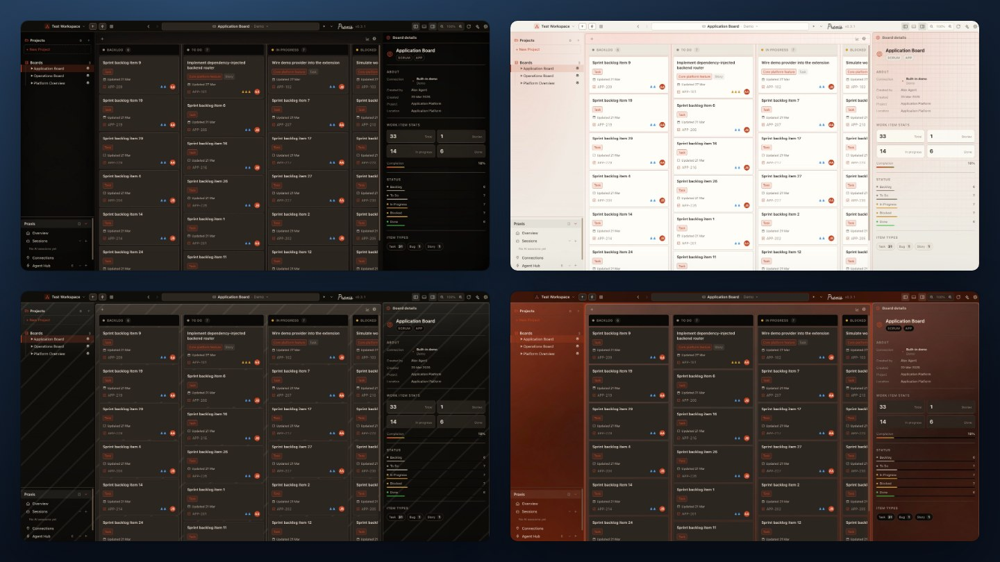
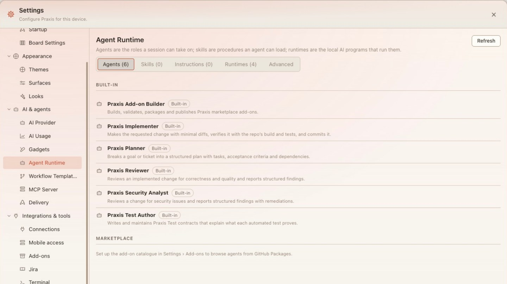

<h1 align="center">
   Praxis
</h1>

<p align="center">
  <a href="https://github.com/davidacres/praxis/stargazers"></a>
  <a href="https://github.com/davidacres/praxis/releases"></a>
  
  
</p>

<p align="center">

<h1>This is a preview, if you would like to contribute or have any ideas, suggestions then please contact me in the discussion board.</h1>
  
  <strong>The workspace where boards, AI agents and delivery meet.</strong><br/>
  Plan on a board, hand a ticket to an agent, review the diff, ship it — on your desktop, and from your phone.
</p>

<h3 align="center"><a href="https://github.com/davidacres/praxis/releases/latest"><ins>Download Praxis</ins></a></h3>

<p align="center">
  
</p>

## Features

<table>
<tr>
<td width="50%" valign="middle">

### Mobile Companion

Follow live sessions from your phone, read activity, and approve or deny the agent's permission requests from anywhere on your network — end-to-end encrypted, no cloud relay.

[Docs →](docs/published-artifacts/praxis-on-your-phone.html)

</td>
<td width="50%">
  <a href="docs/published-artifacts/praxis-on-your-phone.html"></a>
</td>
</tr>
<tr>
<td width="50%" valign="middle">

### Boards for Any Backend

One board over Jira, GitLab, GitHub, a folder of markdown plans, or app storage. The workflow is data — author the stages once and every backend renders them natively.

[Docs →](docs/published-artifacts/project-details-and-board-surface.html)

</td>
<td width="50%">
  <a href="docs/published-artifacts/project-details-and-board-surface.html"></a>
</td>
</tr>
<tr>
<td width="50%" valign="middle">

### Hand a Ticket to an Agent

Turn a ticket into a session. The agent plans the work, asks before it uses a tool, and reports what it changed. Switch provider mid-session with a handover brief.

[Docs →](docs/published-artifacts/handing-a-ticket-to-an-agent.html)

</td>
<td width="50%">
  <a href="docs/published-artifacts/handing-a-ticket-to-an-agent.html"></a>
</td>
</tr>
<tr>
<td width="50%" valign="middle">

### Review Before You Commit

Every session records the files it touched. Read the diff beside the conversation, then commit or discard in one click. A native Git Graph covers staging, stashes and conflicts.

[Docs →](docs/published-artifacts/handing-a-ticket-to-an-agent.html)

</td>
<td width="50%">
  <a href="docs/published-artifacts/handing-a-ticket-to-an-agent.html"></a>
</td>
</tr>
<tr>
<td width="50%" valign="middle">

### Themes &amp; Surface Packs

Looks, surface patterns and sidebar styles — Noir, Blueprint, Graphite, Parchment, Aurora Glass and more — switchable in Settings and extensible with add-ons.

[Docs →](docs/published-artifacts/praxis-surface-packs.html)

</td>
<td width="50%">
  <a href="docs/published-artifacts/praxis-surface-packs.html"></a>
</td>
</tr>
<tr>
<td width="50%" valign="middle">

### Agent Runtime &amp; Add-ons

Built-in Planner, Implementer, Reviewer, Security Analyst and Test Author agents, plus a marketplace for agents, skills, themes and workflow templates.

[Docs →](docs/published-artifacts/praxis-interface-system.html)

</td>
<td width="50%">
  <a href="docs/published-artifacts/praxis-interface-system.html"></a>
</td>
</tr>
</table>

**Also in the box:**

- **Native Git Graph** — Working, staged, commit and ref comparisons; inline, split and hunk views; file, hunk and line staging; stashes; three-way conflict resolution.
- **Workspaces** — Save a shareable set of projects and connections in a `.workspace.praxis.json` file and commit it. Secrets never travel with it.
- **Governed delivery workflows** — Stage-based runs with policies and bounded QA self-healing.
- **Folder-backed plans** — Point a project at a folder of markdown plans; the board is synthesised from the files.
- **Auto-update** — Signed builds check for and install updates in the background.

---

## Supported Agents

Works with the CLI agents you already use — sessions run against your own sign-in.

<p>
  <a href="https://docs.anthropic.com/claude/docs/claude-code"><kbd>Claude Code</kbd></a> &nbsp;
  <a href="https://github.com/openai/codex"><kbd>Codex</kbd></a> &nbsp;
  <a href="https://github.com/google-gemini/gemini-cli"><kbd>Gemini CLI</kbd></a> &nbsp;
  <a href="https://docs.github.com/en/copilot/how-tos/set-up/install-copilot-cli"><kbd>GitHub Copilot</kbd></a> &nbsp;
  <kbd>+ any ACP agent</kbd>
</p>

---

## Install

### Quick Install

**macOS & Linux:**
```bash
curl -fsSL https://raw.githubusercontent.com/davidacres/praxis/main/scripts/install.sh | bash
```

**Windows (PowerShell):**
```powershell
irm https://raw.githubusercontent.com/davidacres/praxis/main/scripts/install.ps1 | iex
```

### Desktop Downloads — macOS, Windows, Linux

- **[Download the latest release](https://github.com/davidacres/praxis/releases/latest)** — `.dmg` (macOS), `-setup.exe` (Windows), `.AppImage` / `.deb` (Linux)

### Mobile Companion — iOS, Android

Pair with your desktop app (Settings → Mobile access → *Create pairing code*) to follow sessions and approve agent requests from your phone.

---

## Workspace / project / connection model

- **Workspace** — a saved, shareable context (`.workspace.praxis.json`) that groups
  project and connection references without copying their data. The sidebar has a
  workspace switcher; the tree is scoped to the active workspace. Exported files
  carry a `schemaVersion` and the app versions that wrote them, and contain
  references only — never connection secrets.
- **Project** — the unit of planned work, with one board. Work items live either
  in app storage or as markdown plans in the project's folder.
- **Connection** — an external/system backend: Jira MCP, Demo, a folder of
  markdown plans, or a GitLab delivery host.

Desktop Settings → Startup includes **Reopen last workspace**, which restores the
last valid workspace and durable view. With no valid open workspace, Praxis shows
a full-window Getting Started experience for creating or opening one. Projects are
always created inside the open workspace; the first project becomes its default.

## Git workspace

Praxis includes a native Git Graph and diff workspace backed by your Git
repository. It supports working/staged/commit/ref comparisons, Inline/Split/Hunk
views, file/hunk/selected-line staging, confirmed discard, branch and commit
actions, stash workflows, and three-way conflict resolution.

## Backend modes

| Mode | Value | Support |
| --- | --- | --- |
| Jira MCP | `jiracloud` | Primary hosted tracker. Backed by an external Jira MCP server. Board/issue operations, comments, transitions, linked-epic flows, delivery automation. |
| Demo | `demo` | Built-in sample data for development and demos. Off by default. |
| Folder | `folder` | Reads markdown feature plans from one or more folders on disk; can optionally create/update local issue files. |
| GitLab | `gitlab` | Connection and delivery/MR workflows; the issue/board model does not match Jira parity. |
| GitHub | `github` | Configuration surface only; no full board/issue backend yet. |

## Automatic updates

Packaged desktop builds check for updates automatically on launch and in the
background. When an update is ready, Praxis installs it on next launch or
immediately via the **Restart to update** button in the title bar. Update
preferences and manual checks are available under **Settings → Workspace → Updates**.

## Known limitations

- GitHub mode is not yet a full issue/board backend.
- GitLab support is strongest around delivery/MR workflows.
- Task Designer website-preview nodes only show sites that permit iframe embedding.
- Some automation flows depend on correct Jira/GitLab credentials, workflow
  settings, tracked boards, and repository setup.
