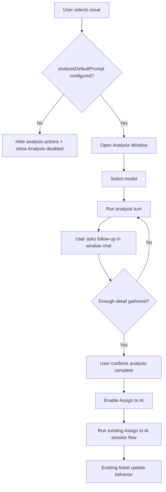
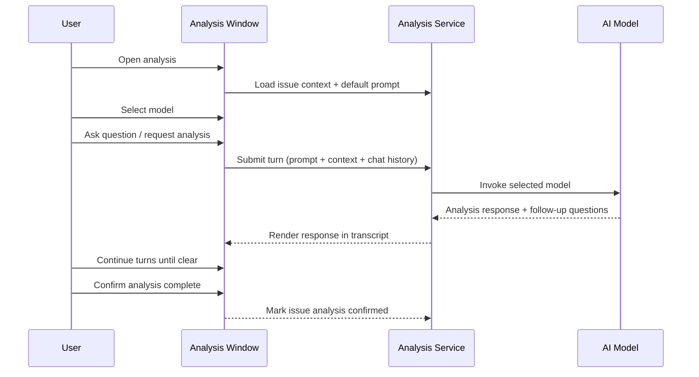

# Feature 06: Analysis Window Gate Before AI Assignment

**Status:** Obsolete
**Created:** 2026-05-20T00:00:00.000Z
**Type:** Feature
**Priority:** P1
**Complexity:** Medium
**Risk:** Medium
**Confidence:** High
**Dependencies:** None

## Description
Add a dedicated per-issue Analysis Window that behaves like a local chat for analysis and clarification. Analysis is gated by a required default prompt setting, supports model selection, and requires explicit user confirmation before Assign to AI can proceed using the existing AI session and ticket update pipeline.

## Acceptance Criteria
1. Analysis actions are hidden when praxis.ai.analysisDefaultPrompt is empty.
2. Analysis actions become visible when praxis.ai.analysisDefaultPrompt is configured.
3. Analysis Window provides chat-like multi-turn interaction and a selectable model.
4. Status bar shows Analysis enabled or Analysis disabled state and updates when settings change.
5. Assign to AI is blocked until the user confirms analysis completion.
6. After confirmation, Assign to AI uses the existing built-in AI session flow and ticket updates.

## Items

| Ref | Type | Name | Status |
| --- | --- | --- | --- |
| 06.1 | Story | Add analysis settings, gating, and status-bar state | ✓ Obsolete |
| 06.2 | Story | Implement per-issue Analysis Window with model selection | ✓ Obsolete |
| 06.3 | Story | Enforce analysis confirmation gate before Assign to AI | ✓ Obsolete |

## Dependencies
1. Story 06.2 depends on 06.1.
2. Story 06.3 depends on 06.1 and 06.2.

## Workflow Diagram

## Analysis Loop Diagram

## Analysis Execution Contract

Use both explicit steps and a system prompt. The system prompt guides model behavior, but deterministic product behavior must be enforced in code.

### Code-Enforced Steps

1. Require praxis.ai.analysisDefaultPrompt to be non-empty before showing analysis actions.
2. Open per-issue Analysis Window and load persisted chat/model state.
3. Use selected model for each turn (default from setting, then user override).
4. Keep all clarification interaction local to the Analysis Window.
5. Require explicit user confirmation before enabling Assign to AI.
6. Route post-confirm assignment through the existing session and ticket update pipeline.

### System Prompt Responsibilities

1. Analyze issue details and known repository context.
2. Ask targeted clarification questions when details are missing.
3. Produce concise assumptions, risks, and readiness summary in each turn.
4. Avoid implementation execution and ticket mutation during analysis stage.

## Suggested Default Prompt Template

Use this as the baseline value for praxis.ai.analysisDefaultPrompt:

"You are performing pre-implementation analysis for a ticket. Review ticket details and relevant repository context. Ask focused clarification questions when information is missing. Maintain a concise running summary with assumptions, risks, and unknowns. Do not implement code or mutate ticket state. End each response with a readiness status: Ready or Needs Clarification."

## Verification
1. Verify analysis actions are hidden when praxis.ai.analysisDefaultPrompt is empty.
2. Verify analysis actions appear when praxis.ai.analysisDefaultPrompt is configured.
3. Verify Assign to AI remains blocked until analysis is explicitly confirmed.
4. Verify Assign to AI still uses existing AI sessions and ticket update behavior after confirmation.
5. Run npm run compile.

## Scoring Review (6 Iterations; Max 10)
1. Iteration 1 (baseline): Complexity Medium, Risk Medium, Confidence Medium.
2. Iteration 2: Added strict scope boundaries (local analysis only, no ticket-side analysis comments) -> Confidence Medium-High.
3. Iteration 3: Added deterministic command/context gating and explicit confirmation contract -> Confidence Medium-High.
4. Iteration 4: Added feature and story workflow diagrams plus execution contract to remove ambiguity -> Confidence High.
5. Iteration 5: Added story-level verification focus on regression boundaries (assign path unchanged) -> Confidence High.
6. Iteration 6 (final): Re-checked coupling and failure modes; Complexity Medium, Risk Medium, Confidence High.

## Comments
**2026-09-10:** Superseded by FX-BF-014 (Workflow experience). Analysis settings gating and per-issue windows are now part of the completed workflow experience implementation.

