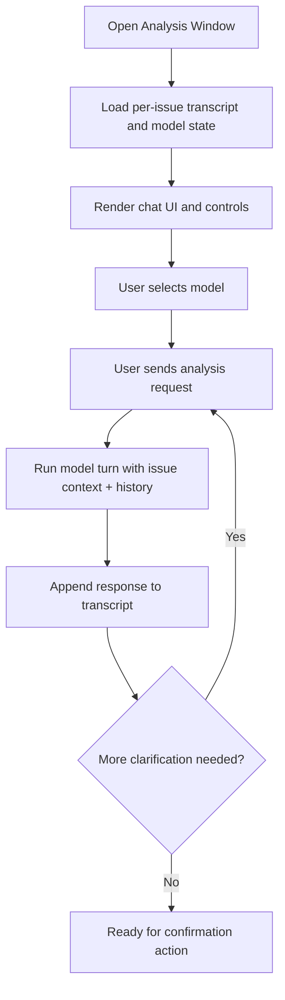

# Story 06.2: Implement Per-Issue Analysis Window With Model Selection

**Status:** Proposed
**Created:** 2026-05-20T00:00:00.000Z
**Type:** Story
**Priority:** P1
**Complexity:** Medium
**Risk:** Medium
**Confidence:** High
**Dependencies:** 06.1

## Description
Implement a dedicated per-issue Analysis Window that acts like a local chat for iterative analysis and clarification with model selection.

## Implementation Activities
1. Add an Analysis Window manager under src/views using existing panel lifecycle and message patterns from copilotSessionPanel and issueDetailPanelManager.
2. Support per-issue panel lifecycle with deterministic create/open/refresh behavior.
3. Build chat-like UI with:
   - Transcript area
   - User input box
   - Send action
   - Model selector
   - Run analysis action
   - Confirm analysis complete action
4. Keep the analysis interaction local to VS Code (no Jira clarification comment loop in this stage).
5. Persist per-issue analysis transcript state and selected model using existing aiSessionManager persistence conventions.

## Acceptance Criteria
1. User can open Analysis Window for an issue from supported entry points.
2. User can run multiple analysis turns in one window session.
3. User can select model in the window and selection persists per issue.
4. Analysis state persists across reload/reopen for the same issue.
5. No Jira clarification comments are posted by the analysis chat flow.

## Workflow Diagram

## Verification
1. Open Analysis Window for a ticket and run at least two chat turns.
2. Change selected model and verify it remains selected after reopening the same issue.
3. Reload window and verify transcript/model state remains available per issue.
4. Confirm no Jira comments are posted during analysis chat turns.
5. Run npm run compile.

## Scoring Review (5 Iterations; Max 10)
1. Iteration 1 (baseline): Complexity Medium, Risk Medium, Confidence Medium.
2. Iteration 2: Reuse of existing webview lifecycle/message patterns validated -> Confidence Medium-High.
3. Iteration 3: State model narrowed to per-issue transcript/model only (no backend write side effects) -> Risk Medium.
4. Iteration 4: Diagrammed flow and explicit acceptance/verification tightened -> Confidence High.
5. Iteration 5 (final): Complexity Medium, Risk Medium, Confidence High.
