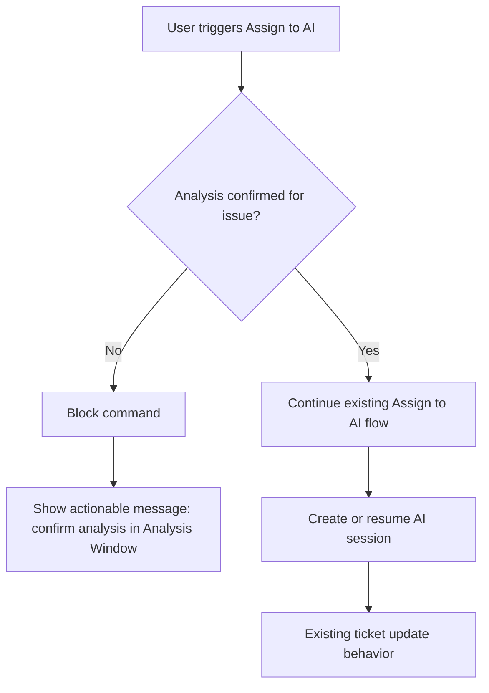

# Story 06.3: Enforce Analysis Confirmation Gate Before Assign To AI

**Status:** Proposed
**Created:** 2026-05-20T00:00:00.000Z
**Type:** Story
**Priority:** P1
**Complexity:** Medium
**Risk:** Medium
**Confidence:** High
**Dependencies:** 06.1, 06.2

## Description
Require explicit user confirmation that analysis is complete before allowing Assign to AI. After confirmation, reuse the existing Assign to AI session and ticket update pipeline unchanged.

## Implementation Activities
1. Add explicit analysis-complete confirmation command and action:
   - ticketManager.confirmAnalysisComplete
2. Track per-issue analysis confirmation state in persisted session metadata.
3. Gate Assign to AI command path to block execution when analysis is not confirmed complete.
4. Provide actionable user-facing feedback when Assign to AI is blocked.
5. Keep post-confirm path unchanged by delegating to the existing Assign to AI flow.

## Acceptance Criteria
1. Assign to AI is blocked before analysis confirmation.
2. Blocking feedback clearly explains how to proceed.
3. Confirming analysis complete enables Assign to AI for that issue.
4. After confirmation, Assign to AI uses existing AI session behavior and ticket update behavior.
5. Regression: existing assign/session flow is unaffected for confirmed issues.

## Workflow Diagram

## Verification
1. Attempt Assign to AI before confirmation and verify it is blocked.
2. Confirm analysis complete and verify Assign to AI succeeds.
3. Verify existing AI session appears and proceeds as current behavior.
4. Verify ticket update behavior remains unchanged after assignment.
5. Run npm run compile.

## Scoring Review (5 Iterations; Max 10)
1. Iteration 1 (baseline): Complexity Medium, Risk Medium, Confidence Medium.
2. Iteration 2: Confirmed guard is a single explicit gate before assign entrypoint -> Risk Medium.
3. Iteration 3: Added actionable failure path and preserved downstream assign behavior unchanged -> Confidence Medium-High.
4. Iteration 4: Added targeted regression verification for unchanged AI session/ticket update flow -> Confidence High.
5. Iteration 5 (final): Complexity Medium, Risk Medium, Confidence High.
